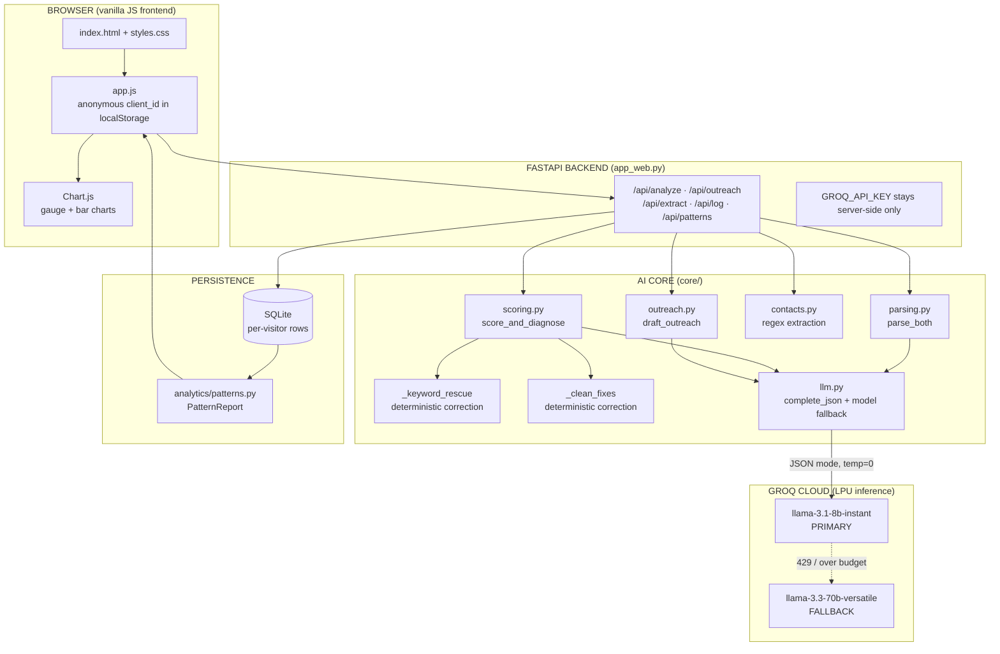

# Hirelens — End-to-End Technical Deep Dive

> **What it is:** an AI tool that takes a résumé + a job description, returns a brutally honest *fit score*, diagnoses the single most likely reason the application gets rejected, lists concrete fixes, surfaces any recruiter contact the posting exposed, and drafts outreach — then aggregates patterns across every application you analyze.
>
> **Live:** https://hirelens-bvnv.onrender.com (primary) · https://huggingface.co/spaces/shadab089/hirelens (mirror)
>
> **Stack in one line:** Vanilla JS + Chart.js frontend → FastAPI backend → a 2-call LLM pipeline on Groq (Llama 3.1 8B primary, 3.3 70B fallback) governed by Pydantic contracts → SQLite storage → Docker on Render / Hugging Face Spaces.

This document is written to be read by *you, in an interview*. Every technical term is explained where it first appears. Read it top to bottom and you can defend any layer of the system.

---

## 0. The 30-second mental model

```
You paste text  ──►  AI reads & structures it  ──►  AI scores the fit  ──►
AI diagnoses the rejection  ──►  deterministic guards correct the AI  ──►
result rendered as charts  ──►  optionally saved to build your pattern profile
```

The core insight that shaped every design decision: **an LLM is excellent at judgement and language, but unreliable at strict bookkeeping.** So the architecture is a *hybrid* — the LLM does the semantic reasoning, and deterministic Python code (regex, set logic) audits and corrects the LLM's output before it ever reaches the user. That split is the most important thing to understand about this project.

---

## 1. Full system architecture (the flow graph)



### The request lifecycle, step by step

1. **User pastes** résumé + JD (or uploads PDF/DOCX → `/api/extract` pulls text via `pypdf`/`python-docx`).
2. **`app.js`** POSTs both texts as JSON to **`/api/analyze`** with an anonymous `client_id`.
3. **FastAPI** validates the request body against a Pydantic model, checks the server-side API key exists.
4. **`parse_both()`** — **LLM call #1** — turns both raw texts into structured `ParsedResume` / `ParsedJD` objects.
5. **`score_and_diagnose()`** — **LLM call #2** — produces the four sub-scores, overall fit, matched/missing requirement lists, AND the rejection diagnosis, in one shot.
6. **Deterministic guards** (`_keyword_rescue`, `_clean_fixes`) correct the LLM's output.
7. **`extract_contacts()`** runs regex over the JD for any published email/phone/apply-link.
8. The backend serializes everything (scores, diagnosis, contacts, a full `ApplicationRecord`) and returns JSON.
9. **`app.js`** renders the gauge, sub-score bars, skill chips, diagnosis card, and contact card.
10. Optionally the user **saves** the record (`/api/log`) → SQLite → the **Patterns** dashboard recomputes via `/api/patterns`.
11. Optionally the user clicks **Generate outreach** → **LLM call #3** (`draft_outreach`) → email + LinkedIn note.

---

## 2. What actually happens *inside the LLM* (the part you asked for)

When the backend calls `client.chat.completions.create(...)`, the prompt string we built doesn't go straight into a "brain." It goes through a precise sequence. Here is that sequence, end to end, with the vocabulary you'll be expected to use.

### 2.1 Tokenization — text becomes integers

A neural network cannot read characters; it reads numbers. **Tokenization** is the step that converts our prompt string into a list of integer IDs.

- Llama 3 models use a **Byte-Pair Encoding (BPE)** tokenizer with a **vocabulary of ~128,000 tokens**. BPE starts from raw bytes and greedily merges the most frequent adjacent pairs into sub-word units learned from a huge corpus.
- A **token** is roughly ¾ of a word in English. `"Snowflake"` might be one token; `"BigQuery"` might split into `["Big", "Query"]`; a rare string splits into more pieces.
- Rule of thumb we relied on all through this project: **~4 characters ≈ 1 token.** That's why `_cap(text, n=2200)` (≈ 550 tokens) and `_cap(text, n=4000)` (≈ 1000 tokens) exist — to keep each prompt inside the model's per-minute token budget.
- Special **control tokens** wrap the conversation: roles like `system`, `user`, `assistant` are marked with reserved tokens (Llama 3 uses a chat template with `<|start_header_id|>`, `<|end_header_id|>`, `<|eot_id|>`). That's how the model knows where your *system instruction* ends and the *user content* begins.

> **Interview line:** "Tokenization is BPE over a 128k vocab; I budgeted prompts in tokens, not characters, because the rate limit is token-based — roughly 4 chars per token."

### 2.2 Embeddings — integers become vectors of meaning

Each token ID indexes into an **embedding matrix**: a giant lookup table of shape `[vocab_size × hidden_dim]`. The lookup returns a dense **vector** (a list of floats) — for an 8B-class model the hidden dimension is on the order of **4096 numbers per token**.

- This vector is the token's **embedding**: a point in high-dimensional space where *semantically related tokens sit near each other*. "SQL" and "PostgreSQL" land in nearby regions; "SQL" and "banana" do not. This is the geometric fact that lets the model treat `"Bachelor of Science"` as *meaning* a bachelor's degree even though the strings differ — the whole reason our semantic matching works at all.
- These are **contextual** once they pass through the network: the same word gets a different final representation depending on its neighbours ("lead" the metal vs. "lead" the role).
- **Positional information** is injected so the model knows word order. Llama uses **RoPE (Rotary Positional Embeddings)** — it *rotates* each token's query/key vectors by an angle proportional to its position, encoding "where in the sequence" directly into the attention math (rather than adding a separate position vector).

> **Note on "embeddings" in *this* app:** Hirelens does **not** run a separate embedding/vector-search step (no RAG, no vector DB). The embeddings live *inside* the LLM's forward pass. The semantic matching ("B.Tech satisfies bachelor's degree") is an *emergent* property of those internal embeddings + attention — we get it for free by asking the model in natural language, instead of computing cosine similarity ourselves. That was a deliberate simplicity choice.

### 2.3 The transformer stack — attention turns vectors into understanding

The embedded sequence flows through a stack of identical **transformer decoder blocks** (dozens of them). Each block has two sub-layers:

1. **Self-attention** — the engine of the whole architecture. For every token, the model computes three projections: a **Query (Q)**, a **Key (K)**, and a **Value (V)**. It scores how much each token should "attend to" every other token via `softmax(Q·Kᵀ / √d)`, then mixes their Values by those weights. Concretely: when the model reads the requirement *"Advanced SQL"* in the JD, attention lets that position look back at *"SQL"* in your résumé and bind them together. **Attention is literally how the model cross-references your résumé against the job description.**
   - Llama 3 uses **Grouped-Query Attention (GQA)**: multiple query heads share a smaller set of key/value heads. This cuts memory and speeds inference with almost no quality loss — important for cheap, fast serving.
   - It's **causal** (masked) attention: each token can only attend to earlier tokens, never future ones. That's what makes it a left-to-right text generator.
2. **Feed-forward network (FFN/MLP)** — a position-wise neural net that transforms each token's representation. Llama uses a **SwiGLU** activation. This is where much of the model's stored "knowledge" lives.

Around each sub-layer: **residual connections** (add the input back to the output, so signal/gradients flow through deep stacks) and **RMSNorm** normalization (stabilizes the numbers). Stack ~32 such blocks for 8B, ~80 for 70B — *that difference in depth and width is the entire reason the 70B model reasons more carefully than the 8B*, and why we use 70B as the quality fallback.

### 2.4 Decoding — vectors become the next word, one at a time

After the final transformer block, the last token's vector is multiplied by an **output projection** to produce **logits**: one raw score for every one of the 128k vocabulary tokens. Then:

- **Softmax** converts logits into a probability distribution over the vocabulary.
- A **sampling** step picks the next token. We set **`temperature=0`**, which means *greedy decoding* — always take the single highest-probability token. **Temperature** scales the distribution before sampling: high temp = flatter = more random/creative; `0` = deterministic and repeatable. We want determinism because this is an analysis tool: the same résumé+JD should give the same score every time, and JSON must be exact.
- The chosen token is appended to the sequence and the whole forward pass runs again for the *next* token. This is **autoregressive generation** — the model writes its JSON answer one token at a time, each new token conditioned on everything so far.
- Generation stops at an end-of-turn token or when we hit **`max_tokens`** (our reserved output budget — 1024–1536 depending on the call). The error you saw earlier, *"max completion tokens reached before generating a valid document,"* was the model running out of this budget mid-JSON.

### 2.5 JSON mode — constrained decoding (why our output is always valid JSON)

We pass `response_format={"type": "json_object"}`. This enables **constrained decoding** (a.k.a. grammar-constrained / structured generation): at each decoding step the server **masks out any token that would make the output invalid JSON**, so the only tokens the model is allowed to emit are ones that keep the document well-formed. This is why `json.loads()` on the response almost never throws. It's a hard guarantee at the decoder level, not a polite request in the prompt.

### 2.6 Where it runs — Groq's LPU

Groq serves these models on an **LPU (Language Processing Unit)** — custom inference silicon (not a GPU) designed specifically for the sequential, one-token-at-a-time nature of LLM decoding. The practical upshot for us: **very low latency and high tokens/second**, which is what makes a 2–3 call pipeline feel near-instant to the user. The trade-off is the **free-tier rate limits** (tokens-per-minute and tokens-per-day) that drove much of our engineering (see §6).

---

## 3. The AI core — how we *use* the LLM

The cleverness of Hirelens isn't any single prompt; it's the **contract-first, hybrid pipeline**. Three ideas:

### 3.1 Contract-first design with Pydantic (`core/schema.py`)

Before any AI code was written, we defined the **data contract** — the exact shape of every object that flows through the system — as **Pydantic v2 models**. Pydantic is a Python library that validates data against a typed schema at runtime and throws if it doesn't match.

```python
class FitScore(BaseModel):
    overall: float                # 0.0 – 1.0
    subscores: list[SubScore]
    matched_skills: list[str]
    missing_skills: list[str]

class Diagnosis(BaseModel):
    likely_stage: RejectionStage  # an Enum: keyword_ats | seniority_mismatch | …
    headline: str
    explanation: str
    top_fixes: list[str]
```

Why this matters:
- It's the **single source of truth**. The parsing layer, scoring layer, frontend, and storage all agree on the same shapes. No layer can drift.
- We literally **feed the JSON Schema of these models to the LLM** (`model_cls.model_json_schema()`) so the model knows exactly what structure to return. Contract and prompt stay in sync automatically.
- Every LLM response is **parsed back into these models**, so a malformed AI output is caught immediately (`ValidationError`) instead of corrupting downstream logic.

`RejectionStage` is a Python **Enum** — a closed set of allowed values (`keyword_ats`, `seniority_mismatch`, `skills_gap`, `domain_mismatch`, `competitive`, `likely_fine`). The model must pick one of these; if it hallucinates a value outside the set, a deterministic `_fallback_stage()` maps the weakest sub-score to a valid stage.

### 3.2 The 2-call pipeline (after optimization)

Originally the pipeline was **4 separate LLM calls**: parse résumé → parse JD → score → diagnose. We **merged them into 2** to halve token usage and latency:

| Call | Function | Input | Output |
|------|----------|-------|--------|
| **#1** | `parse_both()` | résumé text + JD text | `ParsedResume` + `ParsedJD` (skills, seniority, years, titles, required skills, hard requirements) |
| **#2** | `score_and_diagnose()` | the two parsed objects + their full text | four sub-scores + overall fit + matched/missing lists + `Diagnosis` |
| **#3** (on demand) | `draft_outreach()` | the saved record | email subject/body + LinkedIn note |

**Why merging is safe and smart:** parsing résumé and JD are independent extraction tasks that fit naturally in one prompt returning `{"resume": {...}, "job": {...}}`. Scoring and diagnosis are *causally linked* — the diagnosis is literally a narrative explanation of the scores — so asking for both in one call gives the model full context and removes a redundant round-trip. Half the calls = half the tokens = comfortably under the rate limit, and ~2× faster.

### 3.3 Prompt engineering techniques actually used

- **Role priming** — system message casts the model as "a brutally honest technical recruiter AND career coach." Sets tone and rigour.
- **Few-shot-style rules inline** — instead of abstract instructions we gave concrete equivalences: *"'Bachelor's degree' is satisfied by B.Tech, B.E., B.S. … SQL satisfies 'Advanced SQL' … Snowflake/BigQuery anywhere satisfies 'modern data warehouses'."* These were added in direct response to real misclassifications.
- **Explicit output schema in the prompt** — we spell out the exact JSON keys and types, reinforcing the `json_object` constraint.
- **Calibration scales** — seniority is anchored to year-bands (junior ~0–2, mid ~3–5, senior ~5–9, staff ~9+) so the model stops penalizing a 6-year candidate for a "Senior" title.
- **Decision rules / guardrails** — e.g. *"if overall_fit ≥ 0.8 and no sub-score < 0.5, prefer 'likely_fine'"*, and *"never recommend acquiring a skill already on the résumé."*
- **`temperature=0`** — determinism, as explained in §2.4.

### 3.4 The hybrid correction layer (the project's signature idea)

The LLM is the judge, but two deterministic Python passes audit it before the user sees anything. This exists because real users hit real false negatives.

**`_keyword_rescue()`** — fixes "you're missing X" when X is actually present.
- After the model returns `missing_skills`, this pass re-checks each item against the *full résumé text*.
- It extracts the specific technical tokens from a requirement (dropping generic stop-words like "experience", "skills", "ability"), then does a **whole-word regex search** (`\bsnowflake\b`) over the résumé.
- If any specific keyword is found, the requirement is **moved from `missing` to `matched`**.
- A dedicated **degree regex** (`B\.?Tech|B\.?S\.?|M\.?S\.?|bachelor|master|…`) rescues degree requirements — so "B.Tech" correctly satisfies "bachelor's degree."
- *Why deterministic and not just a better prompt?* Because for a factual "is this string present" check, regex is **100% reliable and free**, whereas the model is probabilistic. Use each tool for what it's good at.

**`_clean_fixes()`** — fixes "go learn X" when X is already a listed skill.
- Scans each suggested fix for an *acquisition verb* ("gain experience", "learn", "get certified in"…) co-occurring with a skill the candidate already lists.
- Drops those bogus fixes (with a safe fallback so the user is never left with zero guidance).
- This caught the real bug where the tool told a candidate with Power BI **and** Tableau to "gain experience with Power BI or Tableau."

> **This hybrid pattern is the headline of the whole project:** *LLM for semantic judgement, deterministic code for factual guarantees.* It's exactly how you build trustworthy AI products instead of demos that hallucinate.

### 3.5 Recruiter outreach — extraction + generation

Two sub-features, deliberately kept ToS-safe:
- **`contacts.py`** — pure **regex** over the JD text the *user pasted*. Extracts emails, phone numbers (with filters to avoid matching salary ranges), and apply/careers links. **No scraping, no external lookups** — it only reads text the recruiter voluntarily published. That design choice keeps it legal and ban-proof.
- **`outreach.py`** — an LLM call that drafts a cold email (subject + 90–140 word body) and a sub-300-char LinkedIn note, **grounded in the candidate's matched strengths** and the specific role, signed with a `[Your Name]` placeholder.

---

## 4. Reliability engineering (the unglamorous part that makes it real)

### 4.1 Model fallback across separate token buckets (`llm.py`)

The free tier rate-limits **per model**. Llama 3.1 8B and Llama 3.3 70B have **independent** token buckets. So `complete_json()` tries the primary (8B) first; if it gets a **rate-limit / over-budget error**, it automatically retries on the **70B fallback**. Two buckets ≈ double the effective free capacity, *and* the fallback happens to be the higher-quality model.

```python
_MODELS = ["llama-3.1-8b-instant", "llama-3.3-70b-versatile"]
# try each model; on a rate-limit, jump straight to the next one
```

### 4.2 Graceful failure

- A custom **`GroqRateLimit`** exception bubbles up when *every* model is throttled. The backend catches it and returns a friendly **HTTP 429** — *"We're experiencing high demand, please wait a minute"* — instead of a raw stack trace.
- **Retries with backoff** on transient errors (`time.sleep(1.5 × attempt)`).
- A **60-second client-side timeout** (`AbortController`) so the spinner can never hang forever.
- **Lazy client init** — the Groq client is built on first use, so importing any module never crashes even without an API key (critical for tests and cold deploys).

### 4.3 Token discipline

- `max_tokens` is set *low and explicitly* on every call (1024–1536). Crucially, Groq counts the **reserved** `max_tokens` against the per-minute limit, so over-reserving caused 413 errors until we trimmed it.
- Input text is capped with `_cap()` so a giant résumé can't blow the budget.
- A key parsing fix: we **strip the `raw_text` field from the schema we send the model**, because otherwise the model dutifully echoes the entire résumé back into that field and overruns `max_tokens`. We re-attach the real `raw_text` ourselves afterward — the model never needs to generate it.

---

## 5. The web layer

### 5.1 Backend — FastAPI (`app_web.py`)

- **FastAPI** is an async Python web framework with built-in Pydantic request/response validation and auto-generated OpenAPI docs (`/api/docs`).
- Endpoints: `/api/analyze`, `/api/outreach`, `/api/extract` (file upload → text), `/api/log`, `/api/outcome`, `/api/patterns`, `/api/samples`, `/api/health`.
- **Security boundary:** the `GROQ_API_KEY` lives **only on the server** as an environment variable. The browser never sees it — clients send plain text, the server makes the authenticated LLM calls. This is the correct pattern; putting an API key in frontend JS would expose it to every visitor.
- Serves the static frontend (`web/static/`) via `StaticFiles`.

### 5.2 Frontend — vanilla JS + Chart.js (`web/static/`)

- **No framework** — plain HTML/CSS/JS. Deliberate: keeps the bundle tiny, zero build step, instant load.
- **`Chart.js`** renders the **doughnut gauge** (overall fit) and **horizontal bar charts** (rejection stages, outcomes).
- **Anonymous multi-user isolation without login:** on first visit, `app.js` generates a UUID (`crypto.randomUUID()`) and stores it in **`localStorage`** as the `client_id`. Every save/patterns call carries it, so each visitor sees only their own history — no accounts, no auth, no PII.
- **UX details:** scroll-reveal animations via `IntersectionObserver`, a rotating headline word, copy-to-clipboard buttons (event-delegated), drag-free PDF/DOCX upload, and a CSS rule `[hidden]{display:none!important}` that fixed an overlay bug where a `display:flex` spinner overrode the HTML `hidden` attribute.

### 5.3 Storage & analytics

- **SQLite** (`storage.py`) — a single-file embedded database. Each `ApplicationRecord` is stored as a row scoped by `client_id`, with a migration path and a validated `outcome` field (`rejected | interview | ghosted | offer`).
- **`analytics/patterns.py`** — aggregates a visitor's records into a **`PatternReport`**: total applications, average fit, the **dominant rejection stage** (the bottleneck across all apps, computed only over negative outcomes), and a plain-English insight. This is what turns a one-off check into a *diagnostic profile* — "you get filtered at the keyword stage on 80% of infra roles."

---

## 6. Deployment & MLOps

- **Docker** — `python:3.11-slim` base image. The container runs `uvicorn` (an ASGI server) binding to **`${PORT:-7860}`** — a single trick that makes the *same image* run on **Render** (which injects `$PORT`) and **Hugging Face Spaces** (which expects port 7860).
- **Render** — connected to the GitHub repo; **auto-redeploys on every `git push` to `main`** (continuous deployment). `render.yaml` is an infrastructure-as-code blueprint defining the service + a `/api/health` health check. Note: the free tier **cold-starts** after ~15 min idle.
- **Hugging Face Spaces** — a second live mirror, deployed by pushing to a separate `space` git remote.
- **Secrets** — `GROQ_API_KEY` is set as an environment variable / secret in each platform's dashboard, never committed to git.
- **Git hygiene** — when a token had to be embedded in a remote URL for a push, it was **scrubbed back out** afterward (`git remote set-url`).

---

## 7. End-to-end glossary (rapid-fire interview defense)

| Term | One-liner |
|------|-----------|
| **Token** | The integer unit an LLM reads; ~¾ of a word; ~4 chars. |
| **BPE** | Byte-Pair Encoding — the sub-word tokenizer; ~128k vocab for Llama 3. |
| **Embedding** | A token's meaning as a ~4096-dim vector; similar meanings sit close together. |
| **RoPE** | Rotary Positional Embeddings — encodes word order by rotating Q/K vectors. |
| **Self-attention** | Each token weighs every other token; how the résumé gets cross-referenced against the JD. |
| **GQA** | Grouped-Query Attention — query heads share K/V heads; faster, cheaper inference. |
| **FFN / SwiGLU** | The per-token feed-forward sub-layer where stored knowledge lives. |
| **RMSNorm / residual** | Normalization + skip connections that keep deep stacks trainable/stable. |
| **Logits → softmax** | Raw per-token scores → probability distribution over the vocab. |
| **Temperature** | Randomness knob; we use 0 = greedy/deterministic. |
| **Autoregressive** | Generates one token at a time, each conditioned on all prior tokens. |
| **max_tokens** | Reserved output budget; counts against the rate limit. |
| **Constrained decoding** | JSON mode — masks invalid tokens so output is always valid JSON. |
| **LPU** | Groq's custom LLM-inference chip; low latency, high throughput. |
| **Pydantic** | Runtime schema validation; our data contract and the LLM's output schema. |
| **Enum (RejectionStage)** | A closed set of allowed diagnosis values. |
| **Hybrid correction** | LLM judges, deterministic regex audits/fixes — the project's core idea. |
| **FastAPI / uvicorn / ASGI** | Async Python web framework + server. |
| **client_id in localStorage** | Per-visitor isolation with no login. |
| **Docker / Render / HF Spaces** | Containerized deploy with push-to-deploy CI. |

---

## 8. If an interviewer pushes back — honest trade-offs

- **"Why not RAG / a vector DB?"** — The matching task is bounded (one résumé vs one JD), so the LLM's internal embeddings + attention already do the semantic matching. Adding a vector store would be complexity for no gain. RAG earns its keep when you must retrieve from a *large external corpus*; here there's nothing to retrieve.
- **"Why the small 8B model?"** — Free-tier daily token budget. The 8B handles the structured task well *because* the deterministic guards catch its mistakes, and the 70B is wired as an automatic fallback for quality. The moment paid billing is on, flipping the default to 70B is a one-line env change.
- **"How do you trust the scores?"** — Two ways: deterministic post-correction for factual claims, and an **eval harness** (`evals/`) that runs the scorer over labeled real outcomes and measures whether advanced/offer applications score higher than rejected ones.
- **"What about hallucination?"** — The guards (`_keyword_rescue`, `_clean_fixes`, `_fallback_stage`, Enum validation, JSON-mode constrained decoding) are layered defenses, each catching a different failure mode before it reaches the user.

---

*Hirelens — built as a hybrid LLM system: semantic judgement from the model, factual guarantees from deterministic code, served fast and free, deployed with push-to-ship CI.*
